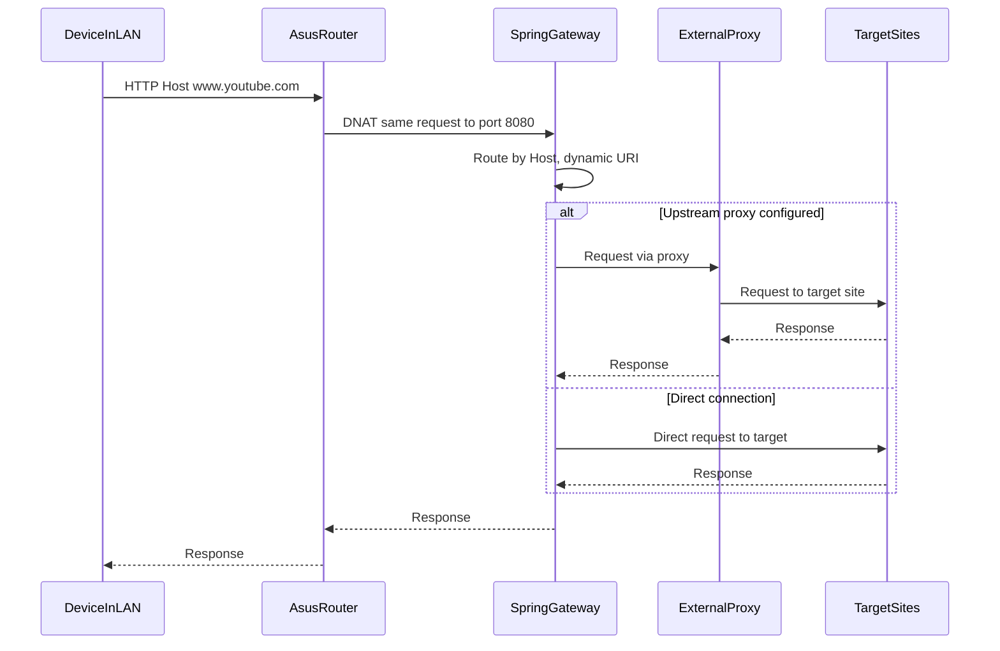

# Поток запросов: прозрачный прокси через Spring Cloud Gateway

Диаграмма описывает сценарий, когда роутер (ASUS RT-AX53U) перенаправляет трафик на Spring Cloud Gateway (DNAT), а gateway проксирует запросы на целевые сайты, опционально через внешний HTTP/SOCKS-прокси.

**Участники:**
- **DeviceInLAN** — устройство в локальной сети (ПК, смартфон).
- **AsusRouter** — роутер ASUS RT-AX53U (правила iptables DNAT).
- **SpringGateway** — Spring Cloud Gateway (например, `192.168.1.100:8080`).
- **ExternalProxy** — опционально: внешний прокси/VPN за рубежом.
- **TargetSites** — целевые сайты (YouTube, OpenAI, Netflix, Mastodon и т.д.).

